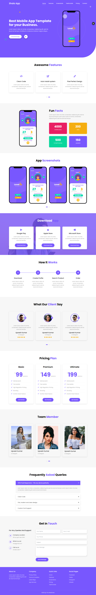
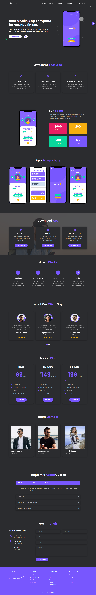

# App Landing Page Template Design using by Html Css Bootstrap

## Template Features:-

## <a href="https://shiv-aap-website.netlify.app"> LIVE DEMO</a>

## *** Main Features  *** 

1. Fully Responsive Layout
2. Light/Dark - Live Switcher
3. Clean Code
4. Html5 & Css3 & Bootstrap 4
5. 100% Customizable, all colors can be customized
6. Font Awesome Icons
7. Google Fonts

## ***  Credits ***

1. freepik
2. pexels
3. Google Fonts 
4. Font Awesome

#### Download Starter Template  : https://drive.google.com/file/d/1g20nr1BeQLkhi8a8vCeTT42M81B-FNH-/view

## All Template Section Name

### Navbar Section

### Home Section

### Features Section

### Fun Facts Section

### App Screenshots Section

### Download App Section

### How It Work Section

### Testimonials Section

### Pricing Section

### Team Section

### FAQ Section

### Contact Section

### Footer Section

### Set Links to Section

### Responsive

### Toggle Theme - Light & Dark

### Preloader

### Responsive bug Fixed

  <b>Design Create by <a href="https://github.com/shivkumarprajapat">Shiv Kumar Prajapat</a></b>

